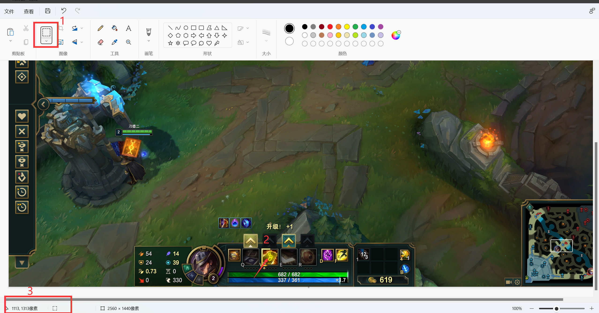

# LOL_Card_Master_Auto_Select_Card
Automatic card selection based on autohotkey

因为该脚本基于autohotkey的取色函数，所以只是检测屏幕上当前活动界面的某个坐标点的RGB颜色信息，因此对系统的开销很小。实测，极小概率会出现的选错牌事件。

The app was previously posted on Bilibili.com, but was taken down due to issues with game script review. By the time it was removed, it had received nearly 3w of views in two days

----
2023/4/24更新：
重构为python脚本。
- 首先按下键盘上的`prt sc`按键，截图选取卡牌技能栏中w中心任意一点
- 将截图粘贴到画图软件中，鼠标放在w上的任意一个像素点（尽量选择w技能框中心的像素点）
- 
- 记录下坐标值，将其填入config.py中的`target_x` 和 `target_y`变量中
- 运行color_detector.py，将会在终端打印出当前坐标点的RGB值
- 打开游戏，卡牌按下w之后，随着w技能框颜色的变化，会打印出多个rgb值
- 找到对应牌的rgb值，填入config.py中的color_dict变量中，可以借助网页判断rgb值的颜色，方便区分不同颜色的牌 https://www.rapidtables.org/zh-CN/convert/color/index.html
- 管理员权限启动cmd，运行auto_selector.py

## 使用说明【旧】
1.环境要求：
- 本人开发环境为win11/10，其他系统没有测试。
- 需要安装autohotkey运行环境，具体百度去autohotkey官网上下载安装包即可
- 运行脚本务必右键`以管理员身份运行`方可成功
- 需要将LOL中`Esc`-`界面`-`用户界面缩放`设置为35，以便取色

2.使用步骤:
- 确认自己LOL中`Esc`-`视频`-`分辨率` 大部分用户是`1920*1080`或者`2560*1440`(还没有上传后者的exe文件，如果有需要联系我主页的微信)，我是带鱼屏`3440*1440`
- 下载仓库中对应的代码或exe文件
- 右键`以管理员身份运行`
- 将弹出的提示框点击确定，测试，`alt+1`是蓝牌、`alt+2`是红牌、`alt+3`是黄牌
- 结束程序将右下角的exe程序关闭即可

